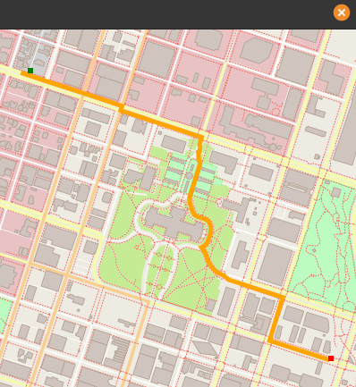
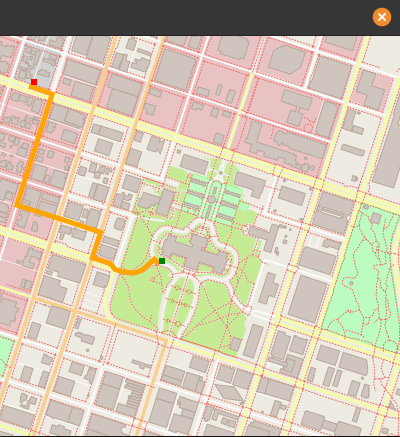

# Route Planning Project

This repo contains the code for a route planner that is able to generate a route between two points from Open Street Maps data. The algorithm used for route planning is **A\* search**.




## Install
### Dependencies

* cmake >= 3.11.3
  * All OSes: [click here for installation instructions](https://cmake.org/install/)
* make >= 4.1 (Linux, Mac), 3.81 (Windows)
  * Linux: make is installed by default on most Linux distros
  * Mac: [install Xcode command line tools to get make](https://developer.apple.com/xcode/features/)
  * Windows: [Click here for installation instructions](http://gnuwin32.sourceforge.net/packages/make.htm)
* gcc/g++ >= 7.4.0
  * Linux: gcc / g++ is installed by default on most Linux distros
  * Mac: same instructions as make - [install Xcode command line tools](https://developer.apple.com/xcode/features/)
  * Windows: recommend using [MinGW](http://www.mingw.org/)
* IO2D
  * For linux:
    ```bash
    git clone --recurse-submodules https://github.com/cpp-io2d/P0267_RefImpl
    cd P0267_RefImpl
    mkdir Debug
    cd Debug
    cmake --config Debug "-DCMAKE_BUILD_TYPE=Debug" ..
    cmake --build .
    make install # Optional: If you want to be able to include this
                 # in your project from anywhere
    ```
    In case *cmake--build .* fails when compailing the SVG sample (at 66%), update the svgpp repository inside P0267 to its current version. (This happened to me in Ubuntu 20.04)
    ```bash
    # Run only if cmake--build .* fails
    cd P0267_RefImpl/P0267_RefImpl/Samples/svg/external/svgpp
    git checkout master
    cd ../../../../../Debug/
    cmake --build .
    ```
    
  * Installation instructions for other operating systems can be found [here](https://github.com/cpp-io2d/P0267_RefImpl/blob/master/BUILDING.md)
  * This library must be built in a place where CMake `find_package` will be able to find it (or installed using *make install*)


## Cloning

When cloning this project, be sure to use the `--recurse-submodules` flag. Using HTTPS:
```bash
git clone https://github.com/jdgalviss/osm-route-planner.git --recurse-submodules
```
or with SSH:
```bash
git clone git@github.com:jdgalviss/osm-route-planner.git --recurse-submodules
```

## Using Docker
There is an associated `Dockerfile` that you can use to reference build instrucions (based on an image of alpine), and do routing without 2d rendering.

## Building using Dockerfile
You can use either Docker or Podman

```bash
$ docker build -t jdgalviss/osm-route-planner .
```

## Running using Dockerfile
Either map your own osm file or use the one provided in the repo.
```bash
$ docker run -it jdgalviss/osm-route-planner 
```

Make sure you enable the `-it` flag so the program can read your inputs from a valid tty session and keyboard strokes.

## Compiling and Running

### Compiling
To compile the project, first, create a `build` directory and change to that directory:
```bash
mkdir build && cd build
```
From within the `build` directory, then run `cmake` and `make` as follows:
```bash
cmake ..
make
```
### Running
The executable will be placed in the `build` directory. From within `build`, you can run the project as follows:
```bash
./OSM_A_star_search
```
Or to specify a map file:
```bash
./OSM_A_star_search -f ../<your_osm_file.osm>
```
Once you run it, the program will ask you to enter the x and y coordinates of the start and goal points. (this are giving as a percentage of the map height and width). For instance:

```bash
./OSM_A_star_search

To specify a map file use the following format: 
Usage: [executable] [-f filename.osm]
Reading OpenStreetMap data from the following file: ../map.osm
Enter the START x-coordinate: 40
Enter the START y-coordinate: 40
Enter the END x-coordinate: 10
Enter the END y-coordinate: 90
```
Gives the following result:



## Testing

The testing executable is also placed in the `build` directory. From within `build`, you can run the unit tests as follows:
```
./test
```

